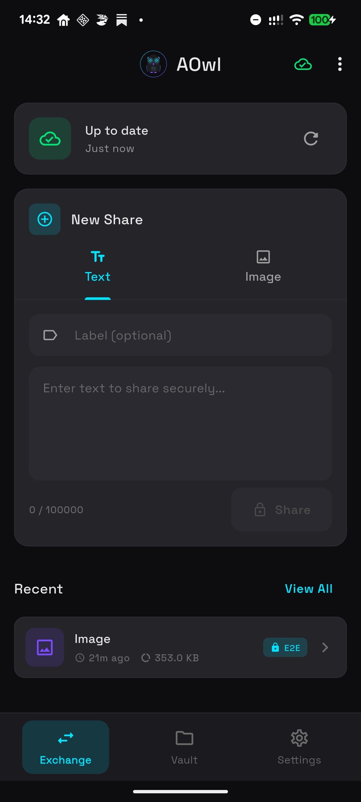

# AOwl

**Partage sécurisé cross-platform avec chiffrement de bout en bout**

AOwl est une application Flutter permettant de partager du texte et des images de manière sécurisée entre vos appareils Android et macOS, en utilisant GitHub comme stockage chiffré.

## Concept

AOwl résout un problème simple : comment partager facilement et en toute sécurité des informations sensibles (mots de passe, notes, images) entre vos différents appareils ?

### Comment ça fonctionne

```
┌─────────────┐                      ┌─────────────┐
│   Android   │                      │    macOS    │
│   (AOwl)    │                      │   (AOwl)    │
└──────┬──────┘                      └──────┬──────┘
       │                                    │
       │  Chiffrement AES-256-GCM           │
       │  (côté client)                     │
       ▼                                    ▼
┌─────────────────────────────────────────────────┐
│              GitHub Repository                   │
│                  .aowl/                          │
│  ┌─────────────────────────────────────────┐    │
│  │  index.enc (index chiffré)              │    │
│  │  <uuid>.enc (fichiers chiffrés)         │    │
│  └─────────────────────────────────────────┘    │
└─────────────────────────────────────────────────┘
```

1. **Chiffrement local** : Toutes les données sont chiffrées sur votre appareil avant d'être envoyées
2. **Stockage GitHub** : Les fichiers chiffrés sont stockés dans un dépôt GitHub privé
3. **Synchronisation** : Vos appareils se synchronisent via GitHub
4. **Déchiffrement local** : Les données sont déchiffrées uniquement sur vos appareils

### Sécurité

- **AES-256-GCM** : Chiffrement authentifié de niveau militaire
- **Argon2id** : Dérivation de clé résistante aux attaques par force brute
- **Zéro connaissance** : GitHub ne voit jamais vos données en clair
- **PIN + Mot de passe** : Double protection pour l'accès à l'application

## Screenshots

<p align="center">
  
</p>

*Écran principal d'AOwl sur Android : synchronisation, partage de texte/images, et liste des éléments récents chiffrés.*

## Installation

### Prérequis

- Flutter SDK 3.10+
- Un compte GitHub
- Un dépôt GitHub privé

### Compilation

```bash
# Cloner le projet
git clone https://github.com/your-username/AOwl.git
cd AOwl

# Installer les dépendances
flutter pub get

# Lancer sur macOS
flutter run -d macos

# Lancer sur Android
flutter run -d <device_id>

# Compiler l'APK Android
flutter build apk
```

## Configuration initiale

### 1. Créer un dépôt GitHub privé

1. Allez sur [github.com/new](https://github.com/new)
2. Créez un nouveau dépôt **privé** (ex: `my-vault`)
3. Ne cochez pas "Initialize with README"

### 2. Générer un Personal Access Token

1. Allez dans **Settings** > **Developer settings** > **Personal access tokens** > **Tokens (classic)**
2. Cliquez sur **Generate new token (classic)**
3. Donnez un nom (ex: "AOwl")
4. Sélectionnez le scope **repo** (accès complet aux dépôts privés)
5. Cliquez sur **Generate token**
6. **Copiez le token** (il ne sera plus visible après)

### 3. Configurer AOwl

Au premier lancement, l'application vous demandera :

| Champ | Description | Exemple |
|-------|-------------|---------|
| Owner/Organization | Votre nom d'utilisateur GitHub | `votre-username` |
| Repository Name | Le nom du dépôt créé | `my-vault` |
| Personal Access Token | Le token généré | `ghp_xxxx...` |
| Master Password | Mot de passe principal (12+ caractères) | Gardez-le précieusement ! |
| PIN | Code à 6 chiffres pour déverrouillage rapide | `123456` |

## Utilisation

### Partager du contenu

1. **Texte** : Appuyez sur "Share Text", entrez votre texte, puis "Encrypt & Share"
2. **Image** : Appuyez sur "Share Image", sélectionnez une image, puis "Encrypt & Share"

### Synchroniser

- **Pull-to-refresh** : Tirez vers le bas pour synchroniser
- La synchronisation est automatique au lancement

### Voir le contenu partagé

- Appuyez sur un élément dans la liste "Recent"
- Le contenu est déchiffré et affiché
- Vous pouvez copier le texte ou sauvegarder l'image

### Verrouiller l'application

- Menu (⋮) > "Lock Vault"
- L'application se verrouille automatiquement en arrière-plan

## Structure du vault

```
.aowl/
├── index.enc          # Index chiffré (liste des entrées)
└── <uuid>.enc         # Fichiers de contenu chiffrés
```

Chaque fichier `.enc` contient :
- IV (vecteur d'initialisation) unique
- Données chiffrées AES-256-GCM
- Tag d'authentification

## Récupération

### Mot de passe oublié ?

Si vous oubliez votre PIN, vous pouvez déverrouiller avec votre mot de passe principal.

Si vous oubliez votre mot de passe principal :
- Les données chiffrées sur GitHub deviennent **irrécupérables**
- Vous pouvez réinitialiser l'application localement
- Gardez votre mot de passe en lieu sûr !

### Migration vers un nouvel appareil

1. Installez AOwl sur le nouvel appareil
2. Entrez les mêmes informations GitHub (owner, repo, token)
3. Entrez le **même mot de passe principal**
4. Vos données seront synchronisées et déchiffrées

## Plateformes supportées

| Plateforme | Status |
|------------|--------|
| Android | ✅ Supporté |
| macOS | ✅ Supporté |
| iOS | 🚧 À venir |
| Windows | 🚧 À venir |
| Linux | 🚧 À venir |
| Web | ❌ Non prévu (sécurité) |

## Licence

MIT License - Voir [LICENSE](LICENSE)

## Contribution

Les contributions sont les bienvenues ! N'hésitez pas à ouvrir une issue ou une pull request.

---

**AOwl** - Vos données, chiffrées, synchronisées, en sécurité.
