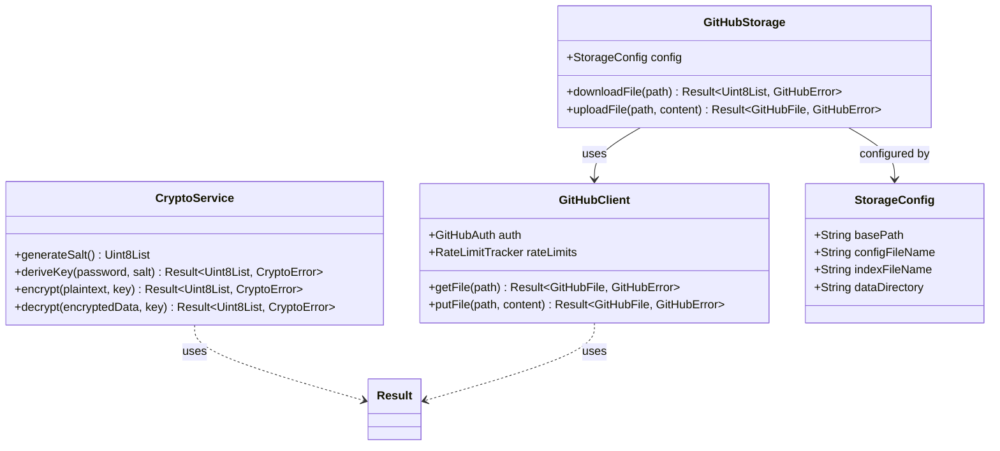

# Plan: Extraire la couche crypto/GitHub en package réutilisable

**Date:** 2026-01-17
**Type:** ♻️ Refactor / Architecture
**Priorité:** Haute

---

## Overview

Extraire les modules crypto et GitHub de l'application AOwl en un package Dart indépendant et réutilisable (`aowl_core`) qui peut être utilisé par d'autres projets nécessitant du chiffrement de bout en bout et du stockage chiffré sur GitHub.

## Problem Statement / Motivation

Actuellement, le code crypto et GitHub est intégré dans l'application AOwl Flutter. Ce code est:
- **Bien conçu** : Architecture propre avec séparation des responsabilités
- **Testé** : Tests unitaires existants
- **Presque indépendant** : Une seule dépendance Flutter (`debugPrint`)

L'extraction permettrait:
1. Réutilisation dans d'autres projets (CLI, autres apps)
2. Meilleure maintenabilité (versioning indépendant)
3. Tests isolés du reste de l'app
4. Contribution potentielle à la communauté

---

## Proposed Solution

### Architecture du Package

```
packages/
  aowl_core/
  ├── lib/
  │   ├── aowl_core.dart              # Exports publics
  │   └── src/
  │       ├── crypto/
  │       │   ├── aes_gcm_cipher.dart
  │       │   ├── argon2_kdf.dart
  │       │   ├── crypto_errors.dart
  │       │   ├── crypto_service.dart
  │       │   ├── secure_compare.dart
  │       │   └── secure_random.dart
  │       ├── github/
  │       │   ├── github_auth.dart
  │       │   ├── github_client.dart
  │       │   ├── github_errors.dart
  │       │   ├── github_storage.dart   # Nouveau: version générique
  │       │   ├── rate_limit_tracker.dart
  │       │   └── models/
  │       │       └── github_file.dart
  │       ├── config/
  │       │   └── vault_config.dart
  │       └── utils/
  │           ├── result.dart
  │           └── logger.dart           # Nouveau: abstraction logging
  ├── test/
  ├── example/
  ├── pubspec.yaml
  ├── README.md
  ├── CHANGELOG.md
  └── LICENSE
```

### API Surface Publique

```dart
// lib/aowl_core.dart
library aowl_core;

// Crypto
export 'src/crypto/crypto_service.dart' show CryptoService;
export 'src/crypto/crypto_errors.dart' show CryptoError;

// GitHub
export 'src/github/github_auth.dart' show GitHubAuth;
export 'src/github/github_client.dart' show GitHubClient;
export 'src/github/github_storage.dart' show GitHubStorage, StorageConfig;
export 'src/github/github_errors.dart' show GitHubError;
export 'src/github/rate_limit_tracker.dart' show RateLimitTracker;
export 'src/github/models/github_file.dart' show GitHubFile, CommitInfo;

// Config
export 'src/config/vault_config.dart' show VaultConfig;

// Utils
export 'src/utils/result.dart' show Result, Success, Failure;
export 'src/utils/logger.dart' show AowlLogger;
```

---

## Technical Approach

### Phase 1: Préparation (Foundation)

#### 1.1 Créer la structure du package

```bash
mkdir -p packages/aowl_core/{lib/src/{crypto,github/models,config,utils},test,example}
```

#### 1.2 Créer pubspec.yaml

```yaml
# packages/aowl_core/pubspec.yaml
name: aowl_core
description: >-
  End-to-end encryption and GitHub-based encrypted storage.
  Provides AES-256-GCM encryption with Argon2id key derivation.
version: 0.1.0
homepage: https://github.com/dgirard/aowl

publish_to: none  # Private pour l'instant

environment:
  sdk: ^3.0.0

dependencies:
  cryptography: ^2.7.0
  pointycastle: ^4.0.0
  crypto: ^3.0.7
  dio: ^5.8.0+1

dev_dependencies:
  test: ^1.24.0
  mocktail: ^1.0.0
  very_good_analysis: ^5.0.0
```

#### 1.3 Créer l'abstraction de logging

```dart
// packages/aowl_core/lib/src/utils/logger.dart
typedef LogCallback = void Function(String message, {String? tag, Object? error});

/// Configurable logger for the aowl_core package.
class AowlLogger {
  static LogCallback? _callback;

  /// Set a custom log callback. Pass null to disable logging.
  static void setCallback(LogCallback? callback) {
    _callback = callback;
  }

  /// Log a debug message.
  static void debug(String message, {String? tag, Object? error}) {
    _callback?.call(message, tag: tag, error: error);
  }
}
```

### Phase 2: Migration du Code (Core Implementation)

#### 2.1 Migrer les fichiers crypto

| Source | Destination | Modifications |
|--------|-------------|---------------|
| `lib/core/crypto/aes_gcm_cipher.dart` | `packages/aowl_core/lib/src/crypto/` | Import paths |
| `lib/core/crypto/argon2_kdf.dart` | `packages/aowl_core/lib/src/crypto/` | Import paths |
| `lib/core/crypto/crypto_errors.dart` | `packages/aowl_core/lib/src/crypto/` | Aucune |
| `lib/core/crypto/crypto_service.dart` | `packages/aowl_core/lib/src/crypto/` | Import paths |
| `lib/core/crypto/secure_compare.dart` | `packages/aowl_core/lib/src/crypto/` | Aucune |
| `lib/core/crypto/secure_random.dart` | `packages/aowl_core/lib/src/crypto/` | Aucune |

#### 2.2 Migrer les fichiers GitHub

| Source | Destination | Modifications |
|--------|-------------|---------------|
| `lib/core/github/github_auth.dart` | `packages/aowl_core/lib/src/github/` | Aucune |
| `lib/core/github/github_client.dart` | `packages/aowl_core/lib/src/github/` | **Remplacer debugPrint** |
| `lib/core/github/github_errors.dart` | `packages/aowl_core/lib/src/github/` | Aucune |
| `lib/core/github/rate_limit_tracker.dart` | `packages/aowl_core/lib/src/github/` | Aucune |
| `lib/core/github/models/github_file.dart` | `packages/aowl_core/lib/src/github/models/` | Aucune |

#### 2.3 Modification de github_client.dart

```dart
// Avant (lib/core/github/github_client.dart:1)
import 'package:flutter/foundation.dart';
// ...
debugPrint('[GitHubClient] $message');

// Après (packages/aowl_core/lib/src/github/github_client.dart)
import '../utils/logger.dart';
// ...
AowlLogger.debug(message, tag: 'GitHubClient');
```

#### 2.4 Créer GitHubStorage (version générique de VaultRepository)

```dart
// packages/aowl_core/lib/src/github/github_storage.dart

/// Configuration for GitHub-based storage.
class StorageConfig {
  final String basePath;           // e.g., '.aowl' or '.mysecrets'
  final String configFileName;     // e.g., 'config.json'
  final String indexFileName;      // e.g., 'index.enc'
  final String dataDirectory;      // e.g., 'data'

  const StorageConfig({
    this.basePath = '.aowl',
    this.configFileName = 'config.json',
    this.indexFileName = 'index.enc',
    this.dataDirectory = 'data',
  });
}

/// Generic encrypted file storage on GitHub.
class GitHubStorage {
  final GitHubClient _client;
  final StorageConfig config;

  GitHubStorage(this._client, {this.config = const StorageConfig()});

  String get _basePath => config.basePath;

  Future<Result<bool, GitHubError>> verifyAccess() async { ... }
  Future<Result<Uint8List, GitHubError>> downloadFile(String path) async { ... }
  Future<Result<GitHubFile, GitHubError>> uploadFile({...}) async { ... }
  // ... autres méthodes génériques
}
```

#### 2.5 Migrer utils et config

| Source | Destination |
|--------|-------------|
| `lib/core/utils/result.dart` | `packages/aowl_core/lib/src/utils/` |
| `lib/core/config/vault_config.dart` | `packages/aowl_core/lib/src/config/` |

### Phase 3: Tests (Polish & Optimization)

#### 3.1 Migrer les tests existants

| Source | Destination |
|--------|-------------|
| `test/core/crypto/aes_gcm_cipher_test.dart` | `packages/aowl_core/test/crypto/` |
| `test/core/crypto/argon2_kdf_test.dart` | `packages/aowl_core/test/crypto/` |
| `test/core/crypto/crypto_service_test.dart` | `packages/aowl_core/test/crypto/` |
| `test/core/crypto/golden_test.dart` | `packages/aowl_core/test/crypto/` |
| `test/core/crypto/secure_compare_test.dart` | `packages/aowl_core/test/crypto/` |
| `test/core/crypto/secure_random_test.dart` | `packages/aowl_core/test/crypto/` |
| `test/core/github/github_client_test.dart` | `packages/aowl_core/test/github/` |

#### 3.2 Vérifier les tests

```bash
cd packages/aowl_core && dart test
```

### Phase 4: Intégration dans AOwl

#### 4.1 Mettre à jour pubspec.yaml de l'app

```yaml
# ashare/pubspec.yaml
dependencies:
  aowl_core:
    path: ../packages/aowl_core
```

#### 4.2 Mettre à jour les imports dans l'app

```dart
// Avant
import '../core/crypto/crypto_service.dart';
import '../core/github/github_client.dart';

// Après
import 'package:aowl_core/aowl_core.dart';
```

#### 4.3 Configurer le logging

```dart
// lib/main.dart
void main() {
  // Configure aowl_core logging
  AowlLogger.setCallback((message, {tag, error}) {
    debugPrint('[$tag] $message');
    if (error != null) debugPrint('Error: $error');
  });

  runApp(const AOwlApp());
}
```

#### 4.4 Adapter VaultRepository dans l'app

```dart
// lib/core/github/vault_repository.dart (reste dans l'app)
import 'package:aowl_core/aowl_core.dart';

class VaultRepository {
  final GitHubStorage _storage;

  VaultRepository(GitHubClient client)
    : _storage = GitHubStorage(client, config: const StorageConfig(
        basePath: '.aowl',
        configFileName: 'config.json',
        indexFileName: 'index.enc',
        dataDirectory: 'data',
      ));

  // Déléguer à _storage avec logique app-specific
}
```

### Phase 5: Documentation

#### 5.1 README.md

```markdown
# aowl_core

End-to-end encryption and GitHub-based encrypted storage for Dart.

## Features

- **AES-256-GCM** encryption with authenticated encryption
- **Argon2id** key derivation (OWASP recommended parameters)
- **GitHub Contents API** client with retry logic and rate limiting
- **Type-safe error handling** with Result types

## Installation

```yaml
dependencies:
  aowl_core:
    git:
      url: https://github.com/dgirard/aowl.git
      path: packages/aowl_core
```

## Usage

### Encryption

```dart
import 'package:aowl_core/aowl_core.dart';

final crypto = CryptoService();

// Derive key from password
final salt = crypto.generateSalt();
final keyResult = await crypto.deriveKey(
  password: 'my-secure-password',
  salt: salt,
);

final key = keyResult.unwrap();

// Encrypt
final encrypted = crypto.encrypt(
  plaintext: utf8.encode('Hello, World!'),
  key: key,
).unwrap();

// Decrypt
final decrypted = crypto.decrypt(
  encryptedData: encrypted,
  key: key,
).unwrap();
```

### GitHub Storage

```dart
final auth = GitHubAuth(
  token: 'ghp_...',
  owner: 'username',
  repo: 'my-vault',
);

final client = GitHubClient(auth: auth);
final storage = GitHubStorage(client);

// Upload encrypted file
await storage.uploadFile(
  path: '.vault/data/file.enc',
  content: encryptedBytes,
  message: 'Add encrypted file',
);
```

## Logging

Configure logging to see debug output:

```dart
AowlLogger.setCallback((message, {tag, error}) {
  print('[$tag] $message');
});
```

## Security

- Keys are derived using Argon2id with OWASP-recommended parameters
- AES-GCM provides authenticated encryption (confidentiality + integrity)
- All random values use `Random.secure()`
```

#### 5.2 CHANGELOG.md

```markdown
# Changelog

## [0.1.0] - 2026-01-17

### Added
- Initial extraction from AOwl application
- CryptoService with AES-256-GCM and Argon2id
- GitHubClient with retry logic and rate limiting
- GitHubStorage for generic encrypted file storage
- Result type for type-safe error handling
- Configurable logging via AowlLogger
```

---

## Acceptance Criteria

### Functional Requirements

- [ ] Le package `aowl_core` compile sans dépendance Flutter
- [ ] `CryptoService` expose encrypt/decrypt/deriveKey
- [ ] `GitHubClient` gère l'authentification et les requêtes avec retry
- [ ] `GitHubStorage` permet upload/download de fichiers
- [ ] `AowlLogger` permet de configurer le logging
- [ ] L'app AOwl utilise le package et fonctionne identiquement

### Non-Functional Requirements

- [ ] Aucune dépendance `flutter/*` dans le package
- [ ] Tests existants passent dans le nouveau package
- [ ] Documentation README complète
- [ ] Exemple d'utilisation fonctionnel

### Quality Gates

- [ ] `dart analyze` sans erreurs
- [ ] `dart test` passe à 100%
- [ ] `dart doc` génère la documentation

---

## Dependencies & Prerequisites

### Dépendances Externes
- `cryptography: ^2.7.0` - Argon2id
- `pointycastle: ^4.0.0` - AES-GCM
- `crypto: ^3.0.7` - SHA-256
- `dio: ^5.8.0+1` - HTTP client

### Prérequis
- Dart SDK ^3.0.0
- Tests existants passent avant migration

---

## Risk Analysis & Mitigation

| Risque | Probabilité | Impact | Mitigation |
|--------|-------------|--------|------------|
| Régression crypto | Faible | Critique | Tests golden existants, vérifier hash de sortie |
| Import cassés | Moyenne | Moyen | Migrer progressivement, tester après chaque fichier |
| Dépendance circulaire | Faible | Moyen | Vérifier les imports avant de copier |

---

## Files Changed Summary

### Nouveaux fichiers (packages/aowl_core/)

```
lib/
  aowl_core.dart                    # Nouveau: exports
  src/
    crypto/
      aes_gcm_cipher.dart           # Copie de lib/core/crypto/
      argon2_kdf.dart               # Copie
      crypto_errors.dart            # Copie
      crypto_service.dart           # Copie
      secure_compare.dart           # Copie
      secure_random.dart            # Copie
    github/
      github_auth.dart              # Copie
      github_client.dart            # Copie + modification debugPrint
      github_errors.dart            # Copie
      github_storage.dart           # Nouveau: version générique
      rate_limit_tracker.dart       # Copie
      models/
        github_file.dart            # Copie
    config/
      vault_config.dart             # Copie
    utils/
      result.dart                   # Copie
      logger.dart                   # Nouveau
test/
  crypto/                           # Copie des tests existants
  github/                           # Copie des tests existants
example/
  example.dart                      # Nouveau
pubspec.yaml                        # Nouveau
README.md                           # Nouveau
CHANGELOG.md                        # Nouveau
LICENSE                             # Nouveau (MIT)
```

### Fichiers modifiés (ashare/)

```
pubspec.yaml                        # Ajouter dépendance path vers aowl_core
lib/main.dart                       # Configurer AowlLogger
lib/core/github/vault_repository.dart  # Utiliser GitHubStorage
lib/application/providers/*.dart    # Mettre à jour imports
lib/features/*/providers/*.dart     # Mettre à jour imports
```

---

## ERD Diagram



---

## References

### Internal References
- Architecture actuelle: `lib/core/crypto/crypto_service.dart:1-100`
- GitHub client: `lib/core/github/github_client.dart:1-200`
- Tests crypto: `test/core/crypto/*.dart`
- Tests GitHub: `test/core/github/*.dart`

### External References
- [Dart Package Layout](https://dart.dev/tools/pub/package-layout)
- [Creating Dart Packages](https://dart.dev/tools/pub/create-packages)
- [OWASP Argon2 Parameters](https://cheatsheetseries.owasp.org/cheatsheets/Password_Storage_Cheat_Sheet.html)
