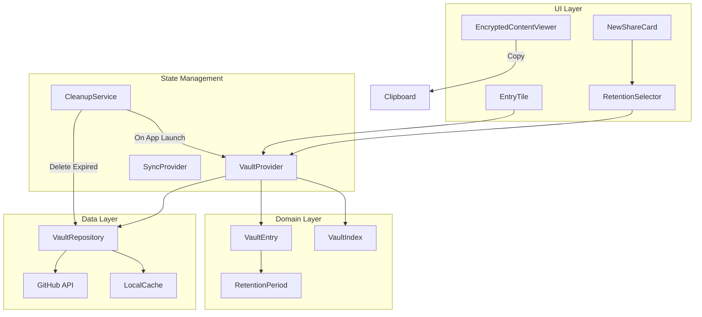

# feat: Document Retention System with Auto-Deletion and Clipboard Support

## Overview

Implement a comprehensive document retention system for AOwl that allows users to:
- Set time-based retention periods on documents (1 minute to 100 years)
- Auto-delete expired documents on app launch
- Copy text and images to clipboard
- Manually delete documents with confirmation
- Change retention period of existing documents

This feature addresses a critical need for secure document sharing: automatic cleanup of sensitive data after a defined period.

## Problem Statement

Currently, AOwl stores documents indefinitely. Users have no control over document lifecycle, which creates security and storage concerns:

1. **Security Risk**: Sensitive documents remain accessible forever
2. **Storage Bloat**: GitHub repository grows unbounded
3. **Compliance**: No ability to enforce data retention policies
4. **User Control**: Cannot set different lifespans for different content types

## Proposed Solution

### Data Model Changes

Add `retentionPeriod` field to `VaultEntry`:

```dart
// lib/features/exchange/domain/vault_entry.dart

/// Retention periods for auto-deletion
enum RetentionPeriod {
  oneMinute('1m', Duration(minutes: 1), '1 minute'),
  oneHour('1h', Duration(hours: 1), '1 hour'),
  oneDay('1d', Duration(days: 1), '1 day'),        // DEFAULT
  oneWeek('1w', Duration(days: 7), '1 week'),
  oneMonth('1M', Duration(days: 30), '1 month'),
  oneYear('1y', Duration(days: 365), '1 year'),
  tenYears('10y', Duration(days: 3650), '10 years'),
  hundredYears('100y', Duration(days: 36500), 'Forever');

  const RetentionPeriod(this.code, this.duration, this.label);

  final String code;
  final Duration duration;
  final String label;

  DateTime calculateExpiration(DateTime from) => from.add(duration);

  static RetentionPeriod fromCode(String code) {
    return RetentionPeriod.values.firstWhere(
      (p) => p.code == code,
      orElse: () => RetentionPeriod.oneDay,
    );
  }
}

class VaultEntry {
  // ... existing fields ...

  /// Retention period for auto-deletion.
  /// null = never expires (backward compatibility)
  final RetentionPeriod? retentionPeriod;

  /// Calculated expiration timestamp
  DateTime? get expiresAt => retentionPeriod?.calculateExpiration(createdAt);

  /// Check if entry has expired (using UTC)
  bool get isExpired {
    final exp = expiresAt;
    return exp != null && DateTime.now().toUtc().isAfter(exp);
  }

  /// Time remaining before expiration
  Duration? get timeRemaining {
    final exp = expiresAt;
    if (exp == null) return null;
    final remaining = exp.difference(DateTime.now().toUtc());
    return remaining.isNegative ? Duration.zero : remaining;
  }
}
```

### Architecture Diagram



## Technical Approach

### Phase 1: Data Model & Schema Migration

**Files to modify:**
- `lib/features/exchange/domain/vault_entry.dart`
- `lib/features/exchange/domain/vault_index.dart`

**Tasks:**

1. Add `RetentionPeriod` enum with all retention options
2. Add `retentionPeriod` field to `VaultEntry`
3. Update JSON serialization/deserialization
4. Add `isExpired`, `expiresAt`, `timeRemaining` getters
5. Bump `VaultIndex.version` to 2
6. Add migration logic for existing entries (default to `null` = never expires)

```dart
// Migration logic in vault_index.dart
factory VaultIndex.fromJson(Map<String, dynamic> json) {
  final version = json['version'] as int? ?? 1;

  // Handle version 1 -> 2 migration
  if (version == 1) {
    // Existing entries get null retention (never expires)
  }

  return VaultIndex(
    version: 2,
    entries: entries,
    updatedAt: updatedAt,
  );
}
```

### Phase 2: Retention Selection UI

**Files to create/modify:**
- `lib/features/exchange/presentation/widgets/retention_selector.dart` (NEW)
- `lib/features/exchange/presentation/widgets/new_share_card.dart`
- `lib/shared/theme/app_colors.dart` (add retention colors)

**Tasks:**

1. Create `RetentionSelector` widget (bottom sheet with options)
2. Add retention selector to `NewShareCard`
3. Default selection: 1 day
4. Show selected retention with icon and label
5. Color-code retention periods (short=red, long=green)

```dart
// retention_selector.dart
class RetentionSelector extends StatelessWidget {
  final RetentionPeriod selected;
  final ValueChanged<RetentionPeriod> onChanged;

  Future<void> _showPicker(BuildContext context) async {
    final result = await showModalBottomSheet<RetentionPeriod>(
      context: context,
      builder: (context) => _RetentionPickerSheet(
        selected: selected,
      ),
    );
    if (result != null) onChanged(result);
  }
}
```

### Phase 3: Entry Display Updates

**Files to modify:**
- `lib/features/exchange/presentation/widgets/entry_tile.dart`
- `lib/features/history/presentation/history_screen.dart`

**Tasks:**

1. Add retention badge to `EntryTile`
2. Show expiration countdown for entries expiring soon (<24h)
3. Color-code based on urgency (red for <1h, orange for <24h)
4. Add "Expires: [relative time]" in entry details
5. Filter/sort by retention period in history

```dart
// In entry_tile.dart
Widget _buildRetentionBadge() {
  final remaining = entry.timeRemaining;
  if (remaining == null) return const SizedBox.shrink();

  final color = remaining.inHours < 1
      ? AppColors.error
      : remaining.inHours < 24
          ? AppColors.warning
          : AppColors.textTertiary;

  return Container(
    padding: const EdgeInsets.symmetric(horizontal: 6, vertical: 2),
    decoration: BoxDecoration(
      color: color.withOpacity(0.15),
      borderRadius: BorderRadius.circular(4),
    ),
    child: Row(
      mainAxisSize: MainAxisSize.min,
      children: [
        Icon(Icons.timer_outlined, size: 12, color: color),
        const SizedBox(width: 4),
        Text(_formatRemaining(remaining), style: TextStyle(color: color)),
      ],
    ),
  );
}
```

### Phase 4: Auto-Deletion Service

**Files to create/modify:**
- `lib/core/services/cleanup_service.dart` (NEW)
- `lib/features/exchange/providers/vault_provider.dart`
- `lib/main.dart`

**Tasks:**

1. Create `CleanupService` class
2. On app launch (after sync), check for expired entries
3. Batch delete expired entries (max 50 per run for rate limits)
4. Handle conflicts gracefully (skip if SHA mismatch)
5. Log deletions for debugging
6. Show snackbar: "X expired documents deleted"

```dart
// cleanup_service.dart
class CleanupService {
  final VaultRepository _repository;
  final CryptoService _crypto;

  Future<CleanupResult> cleanupExpiredEntries(
    VaultIndex index,
    Uint8List masterKey,
  ) async {
    final expired = index.entries.where((e) => e.isExpired).toList();
    if (expired.isEmpty) return CleanupResult.empty();

    // Limit batch size for rate limits
    final batch = expired.take(50).toList();

    int deleted = 0;
    int failed = 0;

    for (final entry in batch) {
      try {
        await _repository.deleteEntry(entry.id, entry.sha);
        deleted++;
      } catch (e) {
        debugPrint('[Cleanup] Failed to delete ${entry.id}: $e');
        failed++;
      }
    }

    // Update index
    final updatedIndex = index.removeEntries(batch.map((e) => e.id));
    await _uploadIndex(updatedIndex, masterKey);

    return CleanupResult(
      deleted: deleted,
      failed: failed,
      remaining: expired.length - batch.length,
    );
  }
}
```

### Phase 5: Clipboard Support (Text + Images)

**Files to modify:**
- `lib/shared/widgets/encrypted_content_viewer.dart`
- `pubspec.yaml` (add super_clipboard)

**Tasks:**

1. Text clipboard already exists - add auto-clear timer
2. Add `super_clipboard` package for image support
3. Add "Copy to Clipboard" button for images
4. Implement 30-second auto-clear for security
5. Show snackbar confirmation

```dart
// In encrypted_content_viewer.dart
Future<void> _copyImageToClipboard(Uint8List imageBytes) async {
  final clipboard = SystemClipboard.instance;
  if (clipboard == null) {
    _showError('Clipboard not available');
    return;
  }

  final item = DataWriterItem();
  item.add(Formats.png(imageBytes));
  await clipboard.write([item]);

  _showSnackBar('Image copied to clipboard');

  // Auto-clear after 30 seconds
  Future.delayed(const Duration(seconds: 30), () async {
    await clipboard.write([]); // Clear clipboard
  });
}
```

### Phase 6: Change Retention Period

**Files to modify:**
- `lib/shared/widgets/encrypted_content_viewer.dart`
- `lib/features/exchange/providers/vault_provider.dart`

**Tasks:**

1. Add "Change Retention" option in entry viewer
2. Show retention selector bottom sheet
3. Update entry metadata
4. Re-encrypt and upload index
5. Recalculate expiration from original `createdAt`

```dart
// In vault_provider.dart
Future<void> changeRetention(String entryId, RetentionPeriod newPeriod) async {
  final index = _currentIndex;
  if (index == null) return;

  final entry = index.getEntry(entryId);
  if (entry == null) return;

  final updated = entry.copyWith(
    retentionPeriod: newPeriod,
    updatedAt: DateTime.now().toUtc(),
  );

  final newIndex = index.updateEntry(updated);
  await _uploadIndex(newIndex);

  state = AsyncValue.data(VaultStateSynced(
    index: newIndex,
    sha: newIndex.sha,
  ));
}
```

## Alternative Approaches Considered

### 1. Folder-Based Storage on GitHub

**Approach**: Store files in retention-specific folders (`.aowl/1d/`, `.aowl/1w/`, etc.)

**Pros:**
- Visual organization on GitHub
- Could enable GitHub Actions for cleanup

**Cons:**
- Requires file moves when changing retention
- More complex API operations
- No real benefit vs metadata field

**Decision**: Rejected - metadata field is simpler and sufficient.

### 2. Absolute Expiration DateTime

**Approach**: Store `expiresAt` timestamp instead of retention period.

**Pros:**
- No calculation needed at runtime
- Clear and explicit

**Cons:**
- Cannot easily display "Retention: 1 week"
- Cannot recalculate if user changes retention

**Decision**: Rejected - store period enum, calculate expiration.

### 3. Background Worker for Deletion

**Approach**: Use `workmanager` package for periodic background cleanup.

**Pros:**
- Works even when app not open
- More timely deletion

**Cons:**
- Complex setup (platform-specific)
- Battery/performance concerns
- May not be reliable on iOS

**Decision**: Deferred - start with on-launch cleanup, add background later if needed.

## Acceptance Criteria

### Functional Requirements

- [ ] User can select retention period when creating document (default: 1 day)
- [ ] Retention options: 1m, 1h, 1d, 1w, 1M, 1y, 10y, 100y
- [ ] Entry tiles show retention badge with remaining time
- [ ] Expired documents are auto-deleted on app launch
- [ ] User can manually delete documents with confirmation
- [ ] User can change retention period of existing documents
- [ ] User can copy text to clipboard (with 30s auto-clear)
- [ ] User can copy images to clipboard (with 30s auto-clear)
- [ ] Existing documents (pre-update) never expire automatically

### Non-Functional Requirements

- [ ] All timestamps stored in UTC
- [ ] Timezone-agnostic expiration calculation
- [ ] Max 50 deletions per app launch (rate limit protection)
- [ ] Schema migration handles existing documents gracefully
- [ ] Clipboard auto-clears for security

### Quality Gates

- [ ] Unit tests for `RetentionPeriod` calculations
- [ ] Unit tests for `VaultEntry.isExpired` with various timezones
- [ ] Integration test for auto-deletion flow
- [ ] Test migration from schema v1 to v2

## Success Metrics

| Metric | Target | Measurement |
|--------|--------|-------------|
| Documents with retention set | >80% of new docs | Analytics |
| Auto-deleted documents | Track count | Logging |
| User errors during deletion | <1% | Error tracking |
| Clipboard usage | Track copies | Analytics |

## Dependencies & Prerequisites

### Technical Dependencies

- `super_clipboard` package for image clipboard support
- Schema version bump (requires careful migration)

### Risks

| Risk | Impact | Mitigation |
|------|--------|------------|
| Data loss from incorrect migration | High | Default existing to "never expires" |
| GitHub rate limits during mass deletion | Medium | Limit batch to 50 per launch |
| Multi-device sync conflicts | Medium | Skip entries with SHA mismatch |
| Timezone bugs | High | All calculations in UTC |

## Resource Requirements

### Estimated Effort

- Phase 1 (Data Model): 2-3 hours
- Phase 2 (UI Selector): 2-3 hours
- Phase 3 (Entry Display): 2-3 hours
- Phase 4 (Auto-Deletion): 3-4 hours
- Phase 5 (Clipboard): 2-3 hours
- Phase 6 (Change Retention): 2-3 hours
- Testing & Polish: 3-4 hours

**Total: ~18-23 hours**

## Future Considerations

1. **Background deletion**: Add WorkManager for more timely cleanup
2. **Retention notifications**: Warn user when document about to expire
3. **Retention statistics**: Show storage by retention period
4. **Bulk retention change**: Select multiple documents
5. **Retention policies**: Default retention by content type

## Documentation Plan

- [ ] Update README with retention feature
- [ ] Add inline code documentation
- [ ] Document migration from v1 to v2 schema

## References & Research

### Internal References

- VaultEntry model: `lib/features/exchange/domain/vault_entry.dart:19-168`
- Delete implementation: `lib/features/exchange/providers/vault_provider.dart:346-385`
- Clipboard (text): `lib/shared/widgets/encrypted_content_viewer.dart:115-146`
- GitHub delete API: `lib/core/github/vault_repository.dart:201-235`

### External References

- [Flutter Clipboard API](https://api.flutter.dev/flutter/services/Clipboard-class.html)
- [super_clipboard package](https://pub.dev/packages/super_clipboard)
- [Dart DateTime UTC handling](https://dart.dev/libraries/dart-core)
- [GitHub Contents API](https://docs.github.com/en/rest/repos/contents)

### Related Work

- Existing delete with confirmation: `entry_tile.dart:174-198`
- Sync conflict handling: `sync_provider.dart:120-151`

---

*Plan created: 2026-01-10*
*AI-assisted with Claude Opus 4.5*
